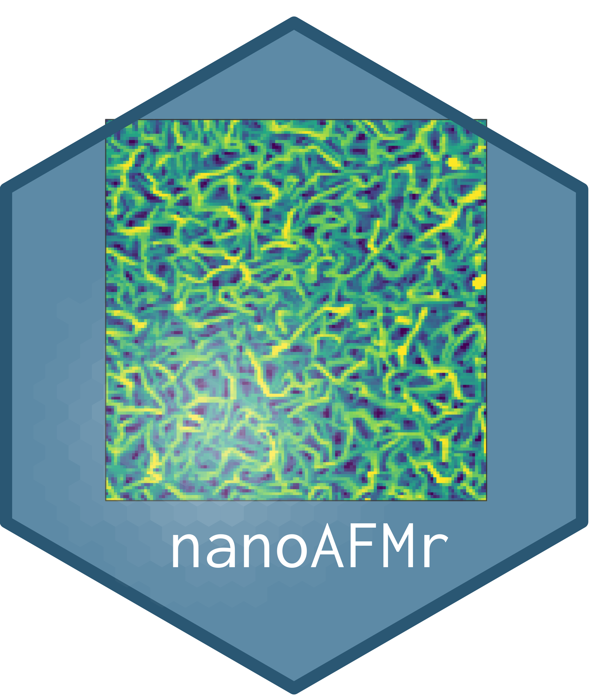

# nanoAFMr 

<!-- badges: start -->
[](https://zenodo.org/badge/latestdoi/580499036)
[](https://CRAN.R-project.org/package=rigakuXRD)
<!-- badges: end -->

Imports and analyzes Atomic Force Microsocpy (AFM) images; four file types are supported, images from Nanosurf (.nid), Bruker / Veeco Multimode Nanoscope III (.000), Park AFM images (.tiff), and Asylum Research AFM Igor images (.ibw).

This package provides three main advantages:

-   **Multi-AFM image analysis**: use identical algorithms on a series of AFM images;
-   **Direct AFM pixel access**: original data is analyzed directly at the pixel level
-   **Reproducible science**: flattening, cropping and profile lines are woven into the history of the image and can be exactly reproduced
-   **Instrument independent**: the AFM data is stored in an open-source `AFMdata` object that is independent from the recording instrument

Therefore, a publishable figure can be produced such that it can be exactly reproduced from the original data. The entire process is stored in the AFMdata as a 'history' element. 


## Installation

Using `R`, install the latest release from the GitHub repository:

``` r
# install.packages("devtools")
devtools::install_github("thomasgredig/nanoAFMr")
```

## Data Classes

Several new data structures (S3 and S4) are introduced:

-   `AFMdata` - S4 class that contains all AFM images from a file
-   `AFMinfo` - S3 class that contains all parameters of the AFM images, such as vibration frequency, etc.
-   `AFMmath` - S3 class that contains computed parameters, such as roughness, etc. about a particular AFM image

## Usage Scenario

Here is a typical usage scenario for AFM image data processing. In the first step, an AFM image is loaded and graphed, the information about the AFM image is also printed.

``` r
library(nanoAFMr)
afm_filename = AFM.getSampleImages("veeco")
a = AFM.import(afm_filename[1])
a = AFM.flatten(a)
print(a)
plot(a)
summary(a)
```

Analysis usually involves plotting a histogram and running a height-height correlation length:

``` r
AFM.histogram(a)                # graph a histogram
AFM.hhcf(a, r.percentage = 70)  # find the correlation length
AFM.math.params(a)              # determine roughness Rq and more
```

Often, a line profile can be useful to visualize the topography. You can either graph a horizontal line profile or any custom profile:

``` r
a2 <- AFM.getLine(a, yPixel = 50)  # horizontal line
plot(a2, addLines = TRUE)          # graph image with line
AFM.linePlot(a2)                   # graph horizontal line profile
AFM.lineProfile(obj,21,225,83,191,unitPixels = T) -> a3
AFM.linePlot(a3) + geom_point(size=2)  # graph arbitrary line profile
```

### AFM data

Use this package to generate `AFMdata` S4 data objects, which can be used to quickly display AFM data and also process AFM data. Here are some examples:

Creating an `AFMdata` data object, then output a graph and output a summary of characteristics:

``` r
fileAFM = AFM.getSampleImages('ibw')
d = AFM.import(fileAFM)
class(d)
plot(d)
print(d)
summary(d)
```

### AFM info

Use the `AFMinfo()` function to obtain information about the AFM image. The information depends on the file format, but some items are common for all images, see `names(h)`, such as `widthPixel`, `scanRate.Hz`, etc.; others can be obtained with `AFMinfo.item()`.

``` r
afmInfo = AFMinfo(AFM.getSampleImages(type='ibw'))
AFMinfo.item(afmInfo, 'ScanSpeed')
```

The AFM image information can also be exported to a file.

``` r
write.csv(afmInfo$data, file='AFMinfo.csv', row.names = FALSE)
```

### AFM math

Some properties about the image are included in the `AFMdata` object, but others - like the roughness - need to be computed. In order to obtain, the computed values, use the `AFMmath` object, which is generated from the `AFMdata` class.

``` r
filename = AFM.getSampleImages(type='ibw')
afmMath = AFM.math.params(AFM.import(filename))
summary(afmMath)
afmMath$Ra
```

## Image Analysis

Several functions are available for image analysis, including:

-   Flatten image
-   Histogram
-   Profile Liens
-   Roughness Analysis
-   Height-height Correlation Function

Example to extract image roughness for a series of images:

``` r
file.list = AFM.getSampleImages()
Ra = c()
for(filename in file.list) {
  Ra = c(Ra, AFM.math.params(AFM.import(filename))$Ra)
}
data.frame(
  name = basename(file.list),
  Ra
)
```

## AFM Image Rating

Finding AFM images based on quality is integrated with the AFM rating system. A user is shown the image and can assign a rating based on the quality of the image. The rating data is user specific and stored in the AFM SQlite database. Use `AFM.readRatings()` and `AFM.writeRatings()` to read / write ratings.

# Acknowledgments

This material is based upon work supported by the National Science Foundation under Grant Number 2018653. Any opinions, findings, and conclusions or recommendations expressed in this material are those of the author and do not necessarily reflect the views of the National Science Foundation.
