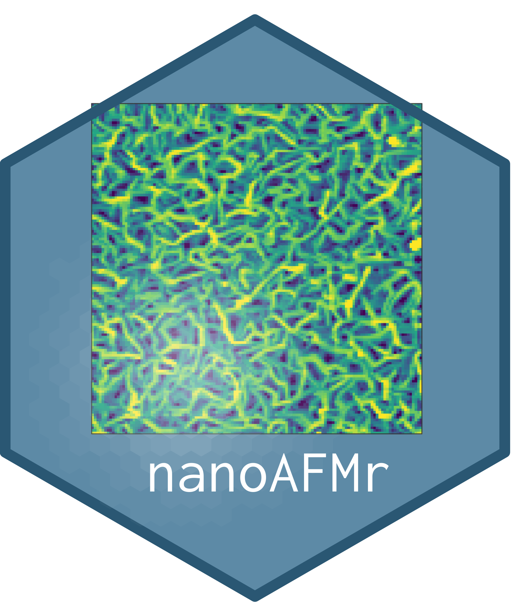

# nanoAFMr — Load and Analyze Atomic Force Microscopy Data Files


[](https://zenodo.org/badge/latestdoi/580499036) [](https://CRAN.R-project.org/package=nanoAFMr)

A compact R package for importing, inspecting, and analyzing Atomic Force Microscopy (AFM) image data.


The package aims to provide the following solutions:

-   **Multi-AFM image analysis**: use identical algorithms on large data sets of AFM images from different instruments;
-   **Direct AFM pixel access**: original data is analyzed directly at the pixel level
-   **Reproducible science**: flattening, cropping and profile lines are woven into the history of the `AFMdata` image class and can be exactly reproduced
-   **Instrument independent**: the AFM data is stored in an open-source `AFMdata` object that is independent from the recording instrument

Therefore, a publishable figure can be exactly reproduced from the original data. The entire process is stored in the `AFMdata` class as a `history` element. 


## Installation

Install from CRAN:

```r
install.packages("nanoAFMr")
```

Or install the development version from GitHub using remotes:

```r
install.packages("pak")
pak::pak("thomasgredig/nanoAFMr")
```

## Basic example

```r
library(nanoAFMr)
# load a packaged sample image, import and plot
file <- AFM.getSampleImages("ibw")[1]
img <- AFM.import(file)
plot(img)
```

For more examples and longer workflows, see the package vignettes (if installed) or the man pages.

## Contributing & Support

Please open issues or pull requests at: https://github.com/thomasgredig/nanoAFMr
For bug reports use: https://github.com/thomasgredig/nanoAFMr/issues

## License

This package is distributed under the AGPL (>= 3). See the DESCRIPTION file for details.

## Citation

To cite this package in publications, use:

```r
citation("nanoAFMr")
```

For further help, consult the man pages (`help(package = "nanoAFMr")`) or contact the maintainer listed in DESCRIPTION.

This material is based upon work supported by the National Science Foundation under Grant Number 2018653. Any opinions, findings, and conclusions or recommendations expressed in this material are those of the author and do not necessarily reflect the views of the National Science Foundation.
