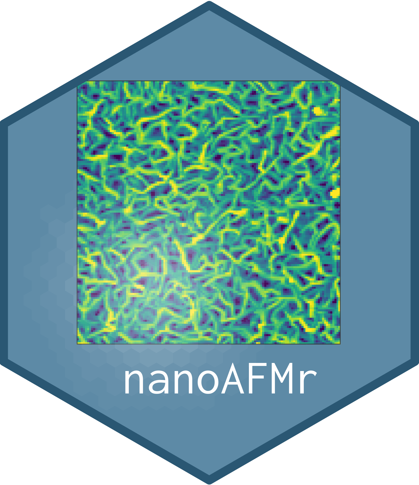

[](https://zenodo.org/badge/latestdoi/184698455)

# nanoAFMr  

Imports and analyzes Atomic Force Microsocpy (AFM) images; currently four types are supported, images from Nanosurf (.nid), Bruker / Veeco Multimode Nanoscope III (.000), Park AFM images (.tiff), and Asylum Research AFM Igor images (.ibw).

This package provides three main advantages:

- Using this data class, a series of images can be analyzed uniformly and quickly within R;
- Access to each data point allows us to integrate mathematical models directly to the original data; 
- Part of reproducible data science that processes raw data directly into publishable figures.


## Installation

Using `R`, install the latest release from the GitHub repository:

```R
# install.packages("devtools")
devtools::install_github("thomasgredig/nanoAFMr")
```

## Data Classes

Several new data structures (S3 and S4) are introduced:

- `AFMdata` - S4 class that contains all AFM images from a file
- `AFMinfo` - S3 class that contains all parameters of the AFM images, such as vibration frequency, etc.
- `AFMmath` - S3 class that contains computed parameters, such as roughness, etc. about a particular AFM image


## Usage

There is a complete description for [nanoAFMr library functions](https://thomasgredig.github.io/nanoAFMr/); examples in the [Article Vignettes](https://thomasgredig.github.io/nanoAFMr/articles/) are also available.


### AFM data

Use this package to generate `AFMdata` S4 data objects, which can be used to quickly display AFM data and also process AFM data. Here are some examples:

Creating an `AFMdata` data object, then output a graph and output a summary of characteristics:

```R
fileAFM = AFM.getSampleImages(type='ibw')[1]
d = AFM.import(fileAFM)
class(d)
plot(d)
print(d)
summary(d)
```

More information on graphing AFM images are found in the [AFM Image Graph Type Vignette](https://thomasgredig.github.io/nanoAFMr/articles/AFM-graphTypes.html).


### AFM info


Use the `AFMinfo()` function to obtain information about the AFM image. The information depends on the file format, but some items are common for all images, see `names(h)`, such as `widthPixel`, `scanRate.Hz`, etc.; others can be obtained with `AFMinfo.item()`.

```R
afmInfo = AFMinfo(AFM.getSampleImages(type='ibw'))
AFMinfo.item(afmInfo, 'ScanSpeed')
```

The AFM image information can also be exported to a file.

```R
write.csv(afmInfo$data, file='AFMinfo.csv', row.names = FALSE)
```

### AFM math

Some properties about the image are included in the `AFMdata` object, but others - like the roughness - need to be computed. In order to obtain, the computed values, use the `AFMmath` object, which is generated from the `AFMdata` class.


```R
filename = AFM.getSampleImages(type='ibw')
afmMath = AFM.math.params(AFM.import(filename))
summary(afmMath)
afmMath$Ra
```


## Image Analysis

Several functions are available for image analysis, including:

* [Flatten image](https://thomasgredig.github.io/nanoAFMr/reference/AFM.flatten.html)
* [Histogram](https://thomasgredig.github.io/nanoAFMr/reference/AFM.histogram.html)
* [Profile lines](https://thomasgredig.github.io/nanoAFMr/reference/AFM.linePlot.html)
* [Roughness analysis](https://thomasgredig.github.io/nanoAFMr/reference/AFM.math.params.html)
* [Height-height correlation function](https://thomasgredig.github.io/nanoAFMr/reference/AFM.hhcf.html)


Example to extract image roughness for a series of images:

```R
file.list = AFM.getSampleImages()
Ra = c()
for(filename in file.list) {
  Ra = c(Ra, AFM.math.params(AFM.import(filename))$Ra)
}
data.frame(
  name = basename(file.list),
  Ra
)
```
